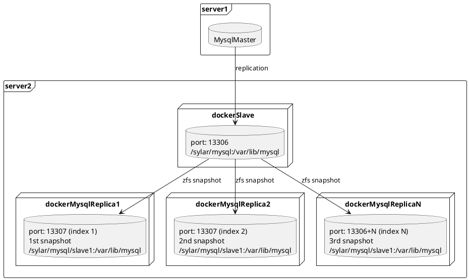
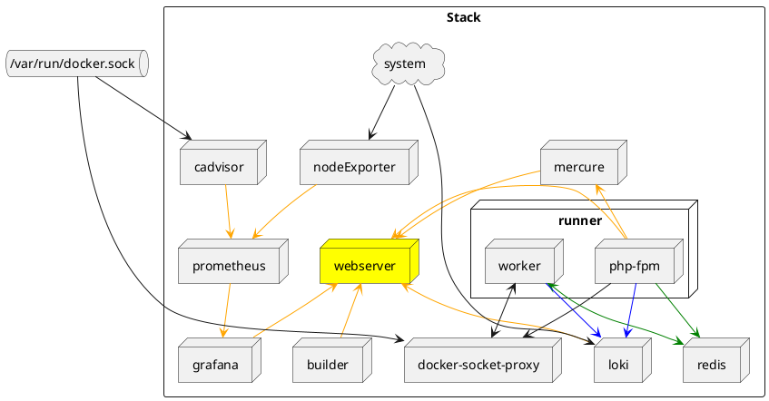

# Sylar

Service cloner for development purpose



# Stack


## Development setup
```
vagrant plugin install vagrant-fsnotify

make host-dev-up
make host-vagrant-init-docker-compose
make host-shell-runner
```

GUI can be accessed on `http://192.168.99.21:8080/app/services`

### In vagrant docker php runner
```
make test
```

## Installation

1. Prepare your host with zfs packages

    ```
    apt-get install zfsutils-linux
    zpool create sylar /dev/sdb /dev/sdc
    ```

2. Install source

    ```
    mkdir /opt/sylar
    cd /opt/sylar
    git clone https://github.com/Groupe-maison-fr/Sylar.git
    ```

3. Customize the `/opt/sylar/data` service configurations

4. Start the services
    ```
    docker-compose up -d
    docker-compose logs -f
    ```

5. GUI can be accessed on `http://xxx.xxx.xxx.xxx:8080/app/services`

## Development

1. Install source and start the stack

    ```
    cd ~/src
    git clone https://github.com/Groupe-maison-fr/Sylar.git
    cd sylar
    make host-dev-up host-vagrant-init-docker-compose
    ```
   this can take a while
2. Open the app the your browser
   - http://192.168.99.21:8080/app/system
3. If you want to modify assets
   ```
   make host-watch-assets
   ```
# TODO
 - psalm
 - log viewer
